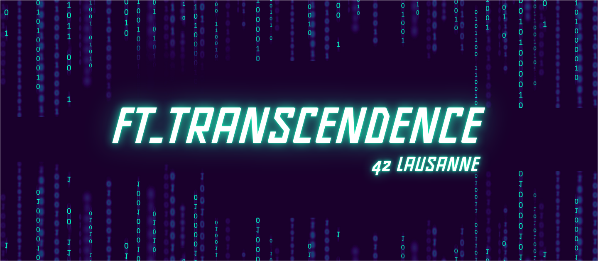

---

# ft_transcendence
So here we are at the ft_transcendence project, a full-stack web application implementing an online Pong game with tournaments, live chat, and user management. Built with **Node.js/Fastify** for the backend, **TypeScript** for the frontend, and a comprehensive DevOps stack including ELK, Prometheus, and Grafana.

[![Contributors][contributors-shield]][contributors-url]
[![Forks][forks-shield]][forks-url]
[![Stargazers][stars-shield]][stars-url]
[![Issues][issues-shield]][issues-url]
[![LinkedIn][linkedin-shield]][linkedin-url]

---

## 📒 Index

- [About](#about)
    - [Implemented Features](#implemented-features)
	- [Architecture](#architecture)
	- [Technologies Used](#technologies-used)
- [Installation](#installation)
- [Testing](#testing)
- [Development](#development)
  - [File Structure](#file-structure)
 <!-- - [Diagram Architecture](#diagram-architecture)  -->
- [Notes](#notes)
- [Credits](#credits)

---

## About

I worked on this project with my teammates [Astoll](https://github.com/42andy) and [Powlar](https://github.com/powlar). ft_transcendence is a multiplayer Pong game platform featuring tournaments, real-time chat, user authentication, and AI opponents. We divided the work as follows:

- **Astoll** handled the database backend ("Use a database for the backend" - minor V.2 Web) and the major module "Standard user management, authentication and users across tournaments" (V.3 User Management), with additional modifications I made to integrate tournaments properly.
- **Powlar** managed the frontend framework ("Use a framework or toolkit to build the front-end" - minor V.2 Web, covering most of the frontend) and the major module for Live Chat (V.4 Gameplay and User Experience).
- **I (HaruSnak)** took care of the entire V.7 DevOps section, the major module "Use a framework to build the backend" (V.2 Web), the mandatory gameplay features including the AI opponent ("Introduce an AI opponent" - major V.5 AI-Algo), the local 1vs1 mode, tournament setup with local login for registered users to save match stats, and XSS protections for frontend inputs. I also created my own frontend specifically for the Pingpong game mode.

The project was developed collaboratively with pair programming for integration and individual contributions for specific modules.

---

## Implemented Features

### V.2 Web

#### Major Module: Use a Framework to Build the Backend
- **Fastify with Node.js** : All backend services use Fastify for RESTful APIs, WebSocket handling, and middleware.
- **Microservices Architecture** : Backend split into independent services (auth, chat, game, user) for scalability.

#### Minor Module: Use a Database for the Backend
- **SQLite Database** : User data, match history, and tournament stats stored in SQLite.
- **Database Integration** : Full CRUD operations with authentication and data persistence.

#### Minor Module: Use a Framework or Toolkit to Build the Front-End
- **TypeScript and Tailwind CSS** : Modern frontend with type safety and responsive design.
- **SPA Architecture** : Single-page application with routing for login, game, chat, and profiles.

### V.3 User Management

#### Major Module: Standard User Management, Authentication and Users Across Tournaments
- **JWT Authentication** : Secure login/logout with token-based sessions.
- **User Profiles** : Registration, profile updates, and match history.
- **Tournament Integration** : Users can join tournaments with stats tracking across games.

### V.4 Gameplay and User Experience

#### Major Module: Live Chat
- **Real-Time WebSocket Chat** : Global and private messaging with user lists.
- **Message Validation** : Sanitization and length limits for security.

### V.5 AI-Algo

#### Major Module: Introduce an AI Opponent
- **AI Pong Player** : Intelligent opponent with difficulty levels for single-player mode.
- **Game Logic** : Ball physics, paddle movement, and scoring implemented in TypeScript.

### V.7 DevOps

#### Major Module: Infrastructure Setup with ELK
- **Elasticsearch** : Log indexing and storage.
- **Logstash** : Log collection and processing from services.
- **Kibana** : Log visualization and dashboards.
- **Security & Retention** : SSL encryption and 30-day log retention policies.

#### Minor Module: Monitoring System
- **Prometheus** : Metrics collection from all services with alerting rules.
- **Grafana** : Dashboards for real-time monitoring and custom visualizations.
- **Metrics Exposure** : Each service exposes `/metrics` for Prometheus scraping.

### Additional Features
- **Tournament System** : Bracket-based tournaments with local player connections.
- **Local Mode** : 1vs1 offline gameplay.
- **HTTPS & Security** : Full SSL encryption, SQL/XSS protections, and input validation.
- **Docker Deployment** : Containerized services with docker-compose for easy setup.

---

## Architecture

The application follows a microservices architecture:
- **Frontend** : TypeScript SPA served by Nginx.
- **Backend Services** : 4 Node.js/Fastify services (auth, chat, game, user) communicating via REST APIs.
- **Database** : SQLite for data persistence.
- **DevOps Stack** : ELK for logging, Prometheus/Grafana for monitoring, all containerized.

---

## Technologies Used

- **Backend** : Node.js, Fastify, SQLite, WebSockets
- **Frontend** : TypeScript, Tailwind CSS, HTML5 Canvas
- **DevOps** : Docker, ELK Stack, Prometheus, Grafana
- **Security** : JWT, HTTPS
- **Game** : Custom Pong logic with AI

---

## Installation

### Prerequisites
- Docker and Docker Compose installed.

### Setup
```bash
# Clone this repository
$ git clone https://github.com/HaruSnak/ft_transcendence
$ cd ft_transcendence

# Start all services
$ make all

# Access the application
# Frontend: https://localhost:8443
# Kibana: http://localhost:5601
# Grafana: http://localhost:3010
# Prometheus: http://localhost:9090
```

### Environment Variables
Configure `.env` for database passwords, JWT secrets, etc.

---

## Testing

### Automated Tests
```bash
# Run service health checks
$ curl http://localhost:3001/health  # Chat service
$ curl http://localhost:3003/health  # User service

# Test API endpoints
$ curl https://localhost:8443/api/auth/login  # Via Nginx proxy
```

### Manual Tests
- **Gameplay** : Access https://localhost:8443, login, start a game or tournament.
- **Chat** : Send messages in real-time.
- **Monitoring** : Check Grafana dashboards for metrics.
- **Logs** : View in Kibana.

---

## Development
### File Structure

```
.
└── 📁webnul
    └── 📁confs
        ├── eval.conf
    └── 📁includes
        └── 📁config
            ├── ConfigParser.hpp
            ├── GenericConfigParser.hpp
            ├── GenericConfigParser.tpp
            ├── LocationConfig.hpp
            ├── LocationConfigParser.hpp
            ├── ServerConfig.hpp
            ├── ServerConfigParser.hpp
        └── 📁core
            ├── Client.hpp
            ├── WebServ.hpp
        └── 📁http
            ├── HttpParser.hpp
            ├── HttpResponse.hpp
            ├── RequestHandler.hpp
        ├── utils.hpp
    └── 📁obj
        └── 📁srcs
            └── 📁config
                ├── ConfigParser.o
                ├── LocationConfig.o
                ├── LocationConfigParser.o
                ├── ServerConfig.o
                ├── ServerConfigParser.o
            └── 📁core
                ├── WebServ.o
            └── 📁http
                ├── HttpParser.o
                ├── HttpResponse.o
                ├── RequestHandler.o
            └── 📁utils
                ├── errors.o
            ├── main.o
    └── 📁srcs
        └── 📁config
            ├── ConfigParser.cpp
            ├── LocationConfig.cpp
            ├── LocationConfigParser.cpp
            ├── ServerConfig.cpp
            ├── ServerConfigParser.cpp
        └── 📁core
            ├── WebServ.cpp
        └── 📁http
            ├── HttpParser.cpp
            ├── HttpResponse.cpp
            ├── RequestHandler.cpp
        └── 📁utils
            ├── errors.cpp
        ├── main.cpp
    └── 📁www
        └── 📁api
            ├── index.php
            ├── test.py
        └── 📁errors
            ├── 404.html
        └── 📁static
            ├── index.html
            ├── script.js
            ├── style.css
        └── 📁uploads
            ├── upload_1752089165.dat
            ├── upload_1752090522.dat
        ├── index.htlm
        ├── index.html
        ├── test.php
        ├── upload.html
    ├── Makefile
    ├── README.md
    ├── tester.sh
    └── webserv
```

<!--### Diagram Architecture
Write the build Instruction here.-->
---

## Notes
Soon

---

## Credits

Project developed as part of 42 School curriculum.

## License
This project is licensed under the MIT License.

- [Astoll](https://github.com/42andy) : Database and User Management
- [Powlar](https://github.com/powlar) : Frontend and Live Chat
- [HaruSnak](https://github.com/HaruSnak) : DevOps, Backend Framework, AI, Tournaments

Resources:
- [Fastify Documentation](https://fastify.dev/)
- [Prometheus Docs](https://prometheus.io/docs/)
- [ELK Stack Guide](https://www.elastic.co/guide/index.html)

[contributors-shield]: https://img.shields.io/github/contributors/HaruSnak/ft_transcendence.svg?style=for-the-badge
[contributors-url]: https://github.com/HaruSnak/ft_transcendence/graphs/contributors
[forks-shield]: https://img.shields.io/github/forks/HaruSnak/ft_transcendence.svg?style=for-the-badge
[forks-url]: https://github.com/HaruSnak/ft_transcendence/network/members
[stars-shield]: https://img.shields.io/github/stars/HaruSnak/ft_transcendence.svg?style=for-the-badge
[stars-url]: https://github.com/HaruSnak/ft_transcendence/stargazers
[issues-shield]: https://img.shields.io/github/issues/HaruSnak/ft_transcendence.svg?style=for-the-badge
[issues-url]: https://github.com/HaruSnak/ft_transcendence/issues
[linkedin-shield]: https://img.shields.io/badge/-LinkedIn-black.svg?style=for-the-badge&logo=linkedin&colorB=555
[linkedin-url]: https://www.linkedin.com/in/shany-moreno-5a863b2aa

